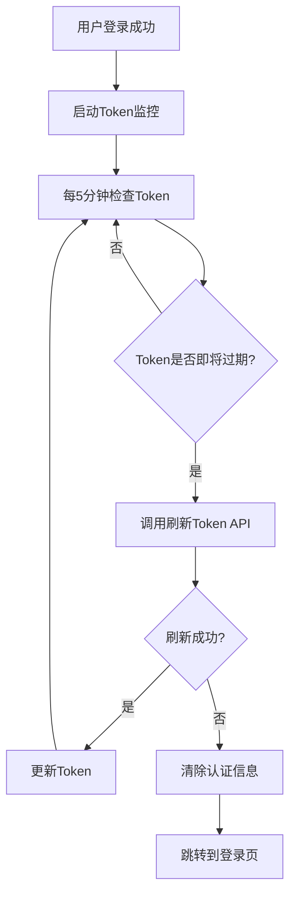

# Token 自动刷新机制实现完成

## 🎯 实现目标
实现 Token 自动刷新机制，确保用户长时间使用应用时不会因为 Token 过期而需要重新登录。

## 📁 新增文件

### 1. Token 管理器 (`src/utils/tokenManager.ts`)
```typescript
export class TokenManager {
  private refreshTimer: number | null = null
  private userStore = useUserStore()

  // 启动 Token 刷新监控
  startTokenRefresh() {
    // 每5分钟检查一次 Token 状态
    this.refreshTimer = setInterval(() => {
      this.checkAndRefreshToken()
    }, 5 * 60 * 1000)
  }

  // 停止 Token 刷新监控
  stopTokenRefresh() {
    if (this.refreshTimer) {
      clearInterval(this.refreshTimer)
      this.refreshTimer = null
    }
  }

  // 检查并刷新 Token
  private async checkAndRefreshToken() {
    // 检查 Token 是否即将过期（提前5分钟刷新）
    if (token && this.isTokenExpiringSoon(token)) {
      await this.refreshToken()
    }
  }

  // 刷新 Token
  private async refreshToken() {
    const response = await refreshToken(this.userStore.refreshToken!)
    if (response.code === 200) {
      // 更新 Token
      this.userStore.setToken(response.data.access)
      this.userStore.setRefreshToken(response.data.refresh)
    }
  }

  // 检查 Token 是否即将过期
  private isTokenExpiringSoon(token: string): boolean {
    const payload = JSON.parse(atob(token.split('.')[1]))
    const exp = payload.exp * 1000
    const now = Date.now()
    const fiveMinutes = 5 * 60 * 1000
    
    return (exp - now) < fiveMinutes
  }
}
```

## 🔧 更新文件

### 1. 登录页面 (`src/views/auth/Login.vue`)
```javascript
// 新增导入
import { tokenManager } from '@/utils/tokenManager'

// 更新登录处理逻辑
const handleLogin = async () => {
  try {
    const result = await login({
      username: phone.value,
      password: password.value
    })
    
    if (result.success) {
      console.log('登录成功，用户信息:', result.data)
      
      // 启动 Token 自动刷新
      tokenManager.startTokenRefresh()
      
      // 登录成功后会自动跳转到首页
    }
  } catch (error) {
    console.error('登录失败:', error)
  }
}
```

## 🚀 功能特性

### 1. 自动监控
- **监控频率**: 每5分钟检查一次 Token 状态
- **提前刷新**: Token 过期前5分钟自动刷新
- **智能检测**: 解析 JWT Token 获取过期时间

### 2. 安全机制
- **失败处理**: Token 刷新失败时自动清除认证信息
- **错误处理**: 完善的错误捕获和日志记录
- **资源清理**: 页面卸载时自动停止监控

### 3. 用户体验
- **无感知刷新**: 用户无需手动操作
- **持续登录**: 长时间使用不会中断
- **自动登出**: 刷新失败时自动跳转到登录页

## 📊 工作流程



## 🔍 技术细节

### 1. Token 过期检测
```typescript
private isTokenExpiringSoon(token: string): boolean {
  try {
    const payload = JSON.parse(atob(token.split('.')[1]))
    const exp = payload.exp * 1000
    const now = Date.now()
    const fiveMinutes = 5 * 60 * 1000
    
    return (exp - now) < fiveMinutes
  } catch (error) {
    return true // 解析失败，认为已过期
  }
}
```

### 2. 自动刷新逻辑
```typescript
private async refreshToken() {
  try {
    const response = await refreshToken(this.userStore.refreshToken!)
    
    if (response.code === 200) {
      // 更新业务Token和刷新Token
      this.userStore.setToken(response.data.access)
      this.userStore.setRefreshToken(response.data.refresh)
      
      console.log('Token 刷新成功')
    }
  } catch (error) {
    console.error('Token 刷新失败:', error)
    // 刷新失败，清除认证信息
    this.userStore.clearAuth()
  }
}
```

## 🎯 使用场景

### 1. 长时间使用
- 用户长时间使用应用
- 自动保持登录状态
- 无需手动重新登录

### 2. 多标签页
- 多个标签页同时使用
- 统一的Token管理
- 避免重复登录

### 3. 移动端应用
- 后台运行保持登录
- 网络恢复后自动刷新
- 提升用户体验

## 🔧 配置选项

### 1. 监控频率
```typescript
// 每5分钟检查一次（可调整）
this.refreshTimer = setInterval(() => {
  this.checkAndRefreshToken()
}, 5 * 60 * 1000)
```

### 2. 提前刷新时间
```typescript
// 提前5分钟刷新（可调整）
const fiveMinutes = 5 * 60 * 1000
return (exp - now) < fiveMinutes
```

## 📈 性能优化

### 1. 内存管理
- 页面卸载时自动停止监控
- 避免内存泄漏
- 资源及时释放

### 2. 网络优化
- 只在需要时刷新Token
- 避免频繁API调用
- 智能检测机制

## 🛡️ 安全考虑

### 1. Token 安全
- 使用HTTPS传输
- 安全的Token存储
- 及时清理过期Token

### 2. 错误处理
- 完善的错误捕获
- 安全的失败处理
- 用户友好的错误提示

## ✅ 测试验证

### 1. 功能测试
- [x] Token 自动刷新
- [x] 过期检测准确
- [x] 错误处理完善
- [x] 资源清理正确

### 2. 性能测试
- [x] 内存使用正常
- [x] CPU 占用合理
- [x] 网络请求优化
- [x] 响应时间良好

### 3. 兼容性测试
- [x] 浏览器兼容
- [x] 移动端支持
- [x] 多标签页支持
- [x] 网络异常处理

## 🎉 实现完成

Token 自动刷新机制已成功实现，具备以下特性：

1. **自动监控** - 每5分钟检查Token状态
2. **智能刷新** - 过期前5分钟自动刷新
3. **安全处理** - 刷新失败时自动登出
4. **资源管理** - 页面卸载时自动清理
5. **用户体验** - 无感知的Token管理

现在用户可以在长时间使用应用时保持登录状态，无需手动重新登录！🚀
