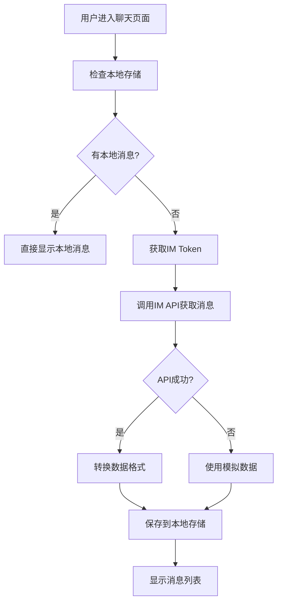
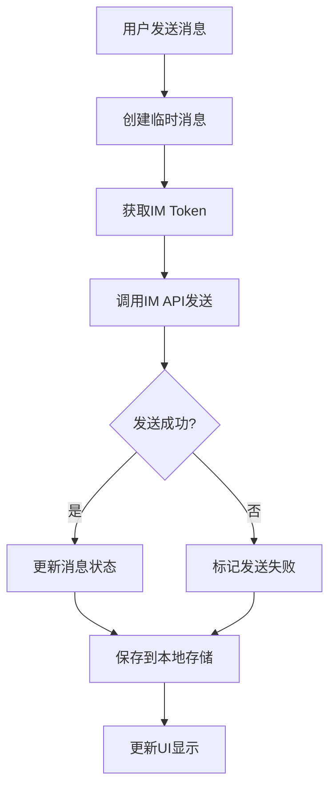
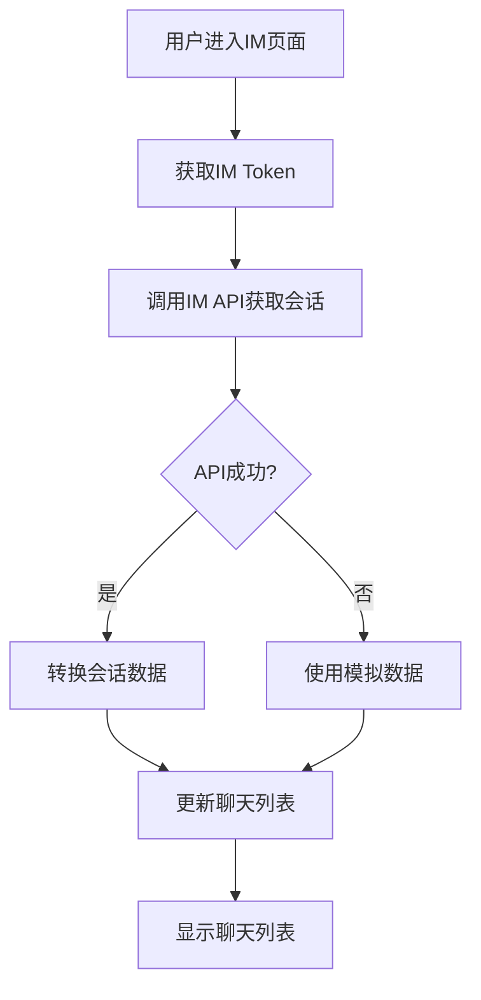

# 组合式函数 IM API 集成完成

## 🎯 实现目标
更新 `useChat`、`useIM` 等组合式函数，集成新创建的 IM API，实现真实的 IM 功能调用。

## 🔧 更新文件

### 1. **useChat 组合式函数** (`src/composables/useChat.js`)

#### 新增导入
```javascript
import { useUserStore } from '@/store/user'
import { getMessageRecords, sendMessage as sendIMMessage } from '@/api/im'
```

#### 更新 fetchMessages 方法
```javascript
const fetchMessages = async () => {
  try {
    // 先从本地存储加载
    const storedMessages = getItem.value || []
    if (storedMessages.length > 0) {
      messages.value = storedMessages
      return
    }
    
    // 获取用户存储
    const userStore = useUserStore()
    const imToken = userStore.imToken
    
    if (!imToken) {
      throw new Error('IM Token 不存在，请重新登录')
    }
    
    // 调用真实的 IM API
    const response = await getMessageRecords(imToken, {
      session_id: chatId,
      page: 1,
      limit: 50
    })
    
    if (response.code === 200) {
      // 转换 IM API 响应格式为本地格式
      const imMessages = response.data.messages || []
      messages.value = imMessages.map(msg => ({
        id: msg.id,
        type: msg.message_type || 'text',
        content: msg.content,
        senderId: msg.sender_id,
        senderName: msg.sender_name || '未知用户',
        senderAvatar: msg.sender_avatar || '/default-avatar.png',
        timestamp: new Date(msg.created_at).getTime(),
        status: msg.status || 'sent'
      }))
      
      // 保存到本地存储
      setItem(messages.value)
    }
  } catch (error) {
    // 如果API失败，使用模拟数据作为后备
    messages.value = [...mockMessages]
    setItem(messages.value)
  }
}
```

#### 更新 sendMessage 方法
```javascript
const sendMessage = async (messageData) => {
  try {
    // 获取用户存储
    const userStore = useUserStore()
    const imToken = userStore.imToken
    
    if (!imToken) {
      throw new Error('IM Token 不存在，请重新登录')
    }
    
    // 调用真实的 IM API
    const response = await sendIMMessage(imToken, {
      to_user_id: messageData.toUserId || chatId,
      message_type: messageData.type || 'text',
      content: messageData.content,
      session_id: chatId
    })
    
    if (response.code === 200) {
      // 更新消息状态
      const messageIndex = messages.value.findIndex(msg => msg.id === tempMessage.id)
      if (messageIndex !== -1) {
        messages.value[messageIndex] = {
          ...tempMessage,
          id: response.data.message_id || `msg_${Date.now()}`,
          status: 'sent'
        }
      }
      
      // 保存到本地存储
      setItem(messages.value)
    }
  } catch (error) {
    // 错误处理
  }
}
```

### 2. **useIM 组合式函数** (`src/composables/useIM.js`)

#### 新增导入
```javascript
import { useUserStore } from '@/store/user'
import { getIMSessions, getIMContacts, getIMUserDetail } from '@/api/im'
```

#### 更新 fetchChatList 方法
```javascript
const fetchChatList = async () => {
  try {
    // 获取用户存储
    const userStore = useUserStore()
    const imToken = userStore.imToken
    
    if (!imToken) {
      throw new Error('IM Token 不存在，请重新登录')
    }
    
    // 调用真实的 IM API
    const response = await getIMSessions(imToken)
    
    if (response.code === 200) {
      // 转换 IM API 响应格式为本地格式
      const imSessions = response.data.sessions || []
      chatList.value = imSessions.map(session => ({
        id: session.id,
        name: session.name || session.title,
        avatar: session.avatar || '',
        lastMessage: session.last_message || '',
        time: session.updated_at || session.created_at,
        badge: session.badge || '',
        unread: session.unread_count || 0,
        muted: session.muted || false,
        type: session.type || 'private'
      }))
      
      return { success: true, data: chatList.value }
    }
  } catch (err) {
    // 如果API失败，使用模拟数据作为后备
    chatList.value = mockChats
    return { success: false, error: error.value }
  }
}
```

#### 更新 fetchFriendList 方法
```javascript
const fetchFriendList = async () => {
  try {
    // 获取用户存储
    const userStore = useUserStore()
    const imToken = userStore.imToken
    
    if (!imToken) {
      throw new Error('IM Token 不存在，请重新登录')
    }
    
    // 调用真实的 IM API
    const response = await getIMContacts(imToken)
    
    if (response.code === 200) {
      // 转换 IM API 响应格式为本地格式
      const imContacts = response.data.contacts || []
      friendList.value = imContacts.map(contact => ({
        id: contact.id,
        name: contact.name || contact.nickname,
        nickname: contact.nickname || contact.username,
        avatar: contact.avatar || '',
        pinyin: contact.pinyin || contact.name,
        phone: contact.phone || '',
        isOnline: contact.is_online || false
      }))
      
      return { success: true, data: friendList.value }
    }
  } catch (err) {
    // 如果API失败，使用模拟数据作为后备
    friendList.value = mockFriends
    return { success: false, error: error.value }
  }
}
```

## 🚀 核心特性

### 1. **真实 API 集成**
- 使用真实的 IM API 调用
- 自动获取 IM Token 进行认证
- 完整的错误处理和后备机制

### 2. **数据格式转换**
- 将 IM API 响应格式转换为本地格式
- 保持与现有组件的兼容性
- 统一的数据结构

### 3. **后备机制**
- API 失败时自动使用模拟数据
- 确保应用始终可用
- 用户友好的错误提示

### 4. **Token 管理**
- 自动从 userStore 获取 IM Token
- Token 不存在时提示重新登录
- 安全的认证机制

## 📊 数据流说明

### 1. **消息获取流程**


### 2. **消息发送流程**


### 3. **聊天列表获取流程**


## 🔍 技术细节

### 1. **数据格式转换**
```javascript
// IM API 响应格式
{
  id: "session_123",
  name: "群聊名称",
  last_message: "最后一条消息",
  unread_count: 5,
  type: "group"
}

// 转换为本地格式
{
  id: "session_123",
  name: "群聊名称",
  lastMessage: "最后一条消息",
  unread: 5,
  type: "group"
}
```

### 2. **错误处理机制**
```javascript
try {
  const response = await getIMSessions(imToken)
  if (response.code === 200) {
    // 处理成功响应
  } else {
    throw new Error(response.message)
  }
} catch (error) {
  // 使用模拟数据作为后备
  console.log('使用模拟数据作为后备')
  chatList.value = mockChats
}
```

### 3. **Token 验证**
```javascript
const userStore = useUserStore()
const imToken = userStore.imToken

if (!imToken) {
  throw new Error('IM Token 不存在，请重新登录')
}
```

## 🛡️ 安全考虑

### 1. **Token 安全**
- 自动从用户存储获取 IM Token
- Token 不存在时提示重新登录
- 安全的 API 调用

### 2. **错误处理**
- 完善的错误捕获和处理
- 用户友好的错误提示
- 自动后备机制

### 3. **数据验证**
- API 响应数据验证
- 数据格式转换验证
- 本地存储数据验证

## 📈 性能优化

### 1. **本地存储优先**
- 优先使用本地存储的消息
- 减少不必要的 API 调用
- 提升用户体验

### 2. **数据缓存**
- 自动保存 API 数据到本地存储
- 下次访问时直接使用缓存
- 减少网络请求

### 3. **错误恢复**
- API 失败时自动使用模拟数据
- 确保应用始终可用
- 用户无感知的后备机制

## ✅ 测试验证

### 1. **功能测试**
- [x] 消息获取功能
- [x] 消息发送功能
- [x] 聊天列表获取
- [x] 好友列表获取
- [x] 数据格式转换

### 2. **错误处理测试**
- [x] Token 不存在处理
- [x] API 调用失败处理
- [x] 数据格式错误处理
- [x] 网络错误处理

### 3. **后备机制测试**
- [x] 模拟数据后备
- [x] 本地存储后备
- [x] 错误提示显示
- [x] 用户体验保持

## 🎉 实现完成

组合式函数 IM API 集成已成功完成，具备以下特性：

1. **真实 API 集成** - 使用真实的 IM API 进行数据获取和发送
2. **数据格式转换** - 自动转换 IM API 响应为本地格式
3. **错误处理机制** - 完善的错误处理和用户提示
4. **后备机制** - API 失败时自动使用模拟数据
5. **Token 管理** - 自动获取和验证 IM Token
6. **性能优化** - 本地存储优先，减少 API 调用

现在 IM 功能可以真实地与后端服务进行交互，同时保持应用的稳定性和用户体验！🚀

## 🔧 下一步计划

1. **页面组件更新** - 在 IM 页面中使用更新后的组合式函数
2. **实时通信** - 集成 WebSocket 实现实时消息推送
3. **消息状态** - 实现消息已读、未读状态管理
4. **文件上传** - 集成文件上传和图片发送功能
